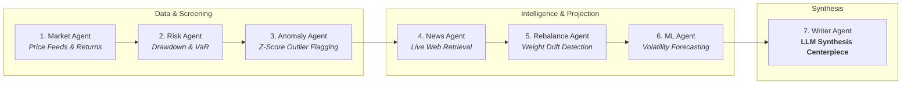

# Investment Portfolio Monitoring Agent

This project demonstrates an **Agentic AI system** designed to autonomously monitor complex, dynamic real-world environments. Using **LangGraph** as a directed state-machine orchestrator, seven specialized AI agents collaborate sequentially—screening numerical data, retrieving live web intelligence, projecting risk trajectories, and synthesizing findings into an actionable executive briefing via a Large Language Model (LLM).

The investment portfolio domain serves as a high-stakes testbed requiring multi-modal coordination: deterministic numerical computation, tool-augmented live web search, and contextual natural language synthesis.

---

## 🤖 Multi-Agent Architecture

The system operates as a **StateGraph** where typed state (`PortfolioMonitoringState`) is passed sequentially across 7 agent nodes. Upstream agents perform statistical screening and information retrieval so that the LLM (Writer Agent) only processes high-signal evidence.



---

## 👥 Agent Roles & Decision Pipeline

| Node | Agent | Core Role & Decision | Technology / Mechanism |
| :--- | :--- | :--- | :--- |
| **Node 1** | **Market Agent** | Ingests market price series, computes asset returns, momentum, and volume trends. | Yahoo Finance API & Pandas |
| **Node 2** | **Risk Agent** | Assesses peak-to-trough drawdown and historical 95% Value at Risk against investor mandate (Conservative / Balanced / Aggressive). | Deterministic Risk Statistics |
| **Node 3** | **Anomaly Agent** | Screens assets for statistical return shocks ($Z > 2.0\sigma$) and volatility spikes. | EWMA Variance & Outlier Filter |
| **Node 4** | **News Agent** | Queries real-time financial news for flagged anomaly assets to explain *why* unexpected movements happened. | Tavily / DuckDuckGo Search API |
| **Node 5** | **Rebalance Agent** | Compares active weights against target allocation and flags drifting positions beyond tolerance. | Deterministic Allocation Bounds |
| **Node 6** | **ML Agent** | Projects 5-day forward realized volatility trajectory and classifies market regime. | Rolling Volatility Estimator |
| **Node 7** | **Writer Agent** *(Centerpiece)* | **LLM Reasoning**: Consolidates quantitative evidence, search findings, and drift analysis into an executive monitoring briefing. | LiteLLM / OpenAI Engine |

---

## 🧠 LLM Usage & Agentic Synthesis

The **Writer Agent** serves as the synthesis centerpiece of the agent pipeline. Rather than generating ungrounded commentary, it operates on a structured prompt loaded with verified evidence passed down through the LangGraph state:
* **Numeric Context**: Active portfolio value, historical 95% VaR, maximum drawdown, and mandate tolerance.
* **Flagged Anomalies**: Assets exceeding statistical thresholds with respective $Z$-scores.
* **Retrieved News**: Verified headlines and market event context from the News Agent.
* **Allocation Drift**: Assets that drifted from investor target weights.

The LLM is prompted to:
1. Deliver a top-level **Executive Takeaway** on overall health and mandate compliance.
2. Provide **Root-Cause Analysis** explaining why flagged positions moved.
3. Recommend specific, actionable **Next Steps** (e.g. rebalancing or stop-loss adjustments).

---

## 🚀 Quickstart & Setup

### 1. Backend Setup (FastAPI & LangGraph)

```bash
cd backend

# Create and activate virtual environment
python -m venv venv
source venv/bin/activate  # On Windows: venv\Scripts\activate

# Install dependencies
pip install -r requirements.txt

# Run the FastAPI server
python api.py
```
*API server runs at `http://localhost:7860` (Interactive docs: `http://localhost:7860/docs`).*

### 2. Frontend Setup (Next.js 14)

```bash
cd frontend

# Install dependencies
npm install

# Start Next.js development server
npm run dev
```
*Web dashboard opens at `http://localhost:3000`.*

---

## 🧪 Testing the Agent Pipeline

To verify the complete 7-agent LangGraph workflow programmatically:

```bash
# From project root
python backend/tests/test_pipeline.py
```
This runs the full state machine end-to-end against `backend/sample_portfolio.csv`.
