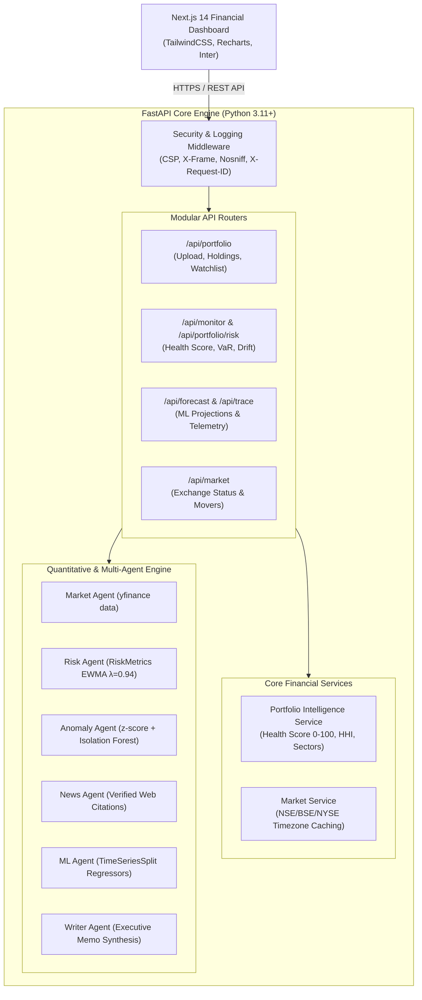

# Investment Portfolio Monitoring Agent

An institutional-grade investment monitoring and downside risk analytics platform inspired by **TradingView, Zerodha Kite, Morningstar, and Bloomberg Terminal**. 

Built with a modular **FastAPI** backend and an institutional **Next.js 14** web dashboard. The platform continuously monitors equity positions, calculates Value-at-Risk (VaR) and Expected Shortfall (CVaR), detects joint return/volatility outliers using **Isolation Forest**, forecasts 5-day realized volatility via multi-model cross-validation, and provides automated Morningstar-style executive briefings with verified news citations.

---

## 🏛 Architecture Overview



---

## Key Financial Capabilities

### 1. Portfolio Health Score (0–100)
A composite institutional rating evaluating:
- **Diversification (30%):** Inverse Herfindahl-Hirschman Index (HHI) measuring effective number of independent assets.
- **Volatility Containment (25%):** Penalizes annualized volatility exceeding benchmark risk bounds.
- **Drawdown Resilience (25%):** Quantifies peak-to-trough drop depth and recovery duration.
- **Concentration Penalty (20%):** Flags single-stock exposure exceeding institutional limits (>25%).

### 2. Quantitative Tail Risk Measurement
- **Parametric & Historical Value-at-Risk (VaR 95% 1-Day):** Estimates potential single-day loss threshold.
- **Conditional VaR (CVaR / Expected Shortfall):** Average loss incurred beyond the 95% VaR cutoff.
- **Cornish-Fisher Expansion:** Adjusts normal distribution assumptions for skewness and kurtosis.
- **Sharpe & Sortino Ratios:** Risk-adjusted return performance vs. risk-free benchmark rates.

### 3. Two-Stage Anomaly Detection
- **Stage 1 (Deterministic):** Evaluates $|z_{i,t}| > 2.0\sigma$ using RiskMetrics™ EWMA variance ($\lambda=0.94$).
- **Stage 1B (Unsupervised ML):** Multivariate `IsolationForest` detecting atypical joint return and volatility dislocations.
- **Stage 2 (Causal Attribution):** LLM synthesis correlating flagged outliers with timestamped news sources.

### 4. Predictive Volatility Forecasting
- **Multi-Model Suite:** Linear Regression, Random Forest (100 estimators), and XGBoost vs. Naive Persistence.
- **Zero Lookahead Leakage:** Validated using `TimeSeriesSplit(n_splits=5, gap=5)` with expanding training windows.

---

## 📁 Repository Structure

```
├── backend/
│   ├── api.py                    # Production ASGI application entry point
│   ├── server/                   # Clean modular backend architecture
│   │   ├── main.py               # FastAPI app factory & exception handlers
│   │   ├── state.py              # Active portfolio and run results state
│   │   ├── middleware/           # Security headers & structured JSON logging
│   │   ├── schemas/              # Pydantic v2 validation models
│   │   ├── services/             # PortfolioService & MarketService
│   │   └── routers/              # Modular endpoint routers
│   ├── agents/                   # Specialist multi-agent coordinators
│   ├── core/                     # Quantitative metrics, anomaly & ML models
│   ├── data/                     # Providers, news search & caching layers
│   ├── memory/                   # SQLite session storage
│   └── eval/tests/               # Backend unit and integration test suites
│
├── frontend/
│   ├── app/                      # Next.js 14 App Router
│   │   ├── page.tsx              # Executive landing & market tape
│   │   ├── dashboard/            # Interactive dashboard (Recharts)
│   │   ├── portfolio/            # CSV upload & mandate configuration
│   │   ├── risk/                 # VaR/CVaR & drawdown analytics
│   │   ├── alerts/               # Material event alerts & citations
│   │   ├── forecast/             # ML volatility projections
│   │   └── trace/                # Agent execution telemetry
│   ├── components/               # Institutional design system
│   │   ├── Navigation.tsx        # Top navbar with live market status
│   │   └── ui/                   # Reusable components (Card, Button, Badge...)
│   └── lib/                      # Centralized Axios client with interceptors
│
├── sample_portfolio.csv          # Ready-to-import sample positions
└── docs/                         # Architecture, deployment, and API guides
```

---

## 🚀 Getting Started

### Prerequisites
- Python 3.10+
- Node.js 18+ and npm

### 1. Backend Setup

```bash
cd backend

# Create and activate virtual environment
python -m venv venv
# Windows:
.\venv\Scripts\activate
# Linux/macOS:
source venv/bin/activate

# Install dependencies
pip install -r requirements.txt

# Run FastAPI backend server (default port 7860)
python api.py
```

- **Health Check:** `http://localhost:7860/health`
- **Interactive OpenAPI Documentation:** `http://localhost:7860/docs`

### 2. Frontend Setup

```bash
cd frontend

# Install dependencies
npm install

# Run Next.js local development server (default port 3000)
npm run dev
```

Visit **`http://localhost:3000`** in your browser.

---

## 🧪 Testing

Run backend tests:

```bash
python -c "from backend.eval.tests.test_api_server import *; test_health_endpoint(); test_market_status_endpoint(); test_watchlist_crud(); test_portfolio_upload_csv(); test_portfolio_upload_invalid_file(); test_health_score_calculation(); test_diversification_concentration_warning(); print('All tests passed!')"
```

Verify frontend production build:

```bash
cd frontend && npm run build
```

---

## 🔒 Security Hardening

- **Security Headers:** Strict enforcement of `X-Content-Type-Options: nosniff`, `X-Frame-Options: DENY`, `Referrer-Policy: strict-origin-when-cross-origin`, and `Content-Security-Policy`.
- **Zero Stack Trace Leaks:** All API exceptions are trapped and returned as structured JSON error responses with unique `request_id` values.
- **Strict File Sanitization:** Uploaded CSVs are capped at 5MB with MIME and column schema verification.
- **CORS Whitelisting:** Configurable origin matching via `CORS_ORIGINS` environment variable.
